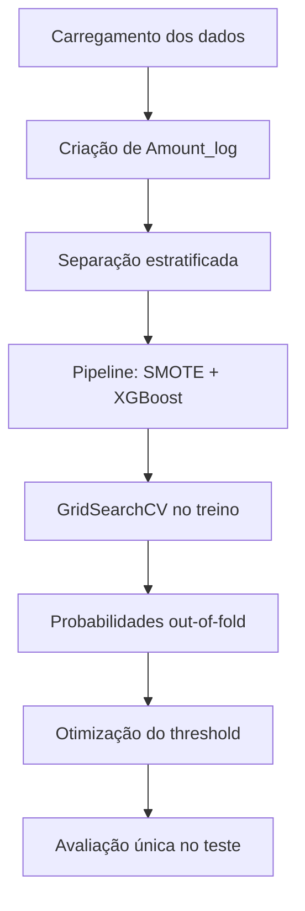

# Detecção de Fraudes Bancárias com Machine Learning

Projeto desenvolvido para o Bootcamp Bradesco com o objetivo de construir um
modelo de classificação capaz de identificar transações potencialmente
fraudulentas em uma base de operações com cartão de crédito.

O principal desafio deste problema é o forte desbalanceamento entre as classes:
das 284.807 transações disponíveis, apenas 492 são fraudes. Isso significa que
aproximadamente 0,17% dos registros pertencem à classe que realmente precisamos
identificar.

Para lidar com esse cenário, o projeto utiliza:

- engenharia de atributos;
- divisão estratificada dos dados;
- SMOTE aplicado exclusivamente aos dados de treinamento;
- validação cruzada;
- XGBoost;
- busca de hiperparâmetros;
- otimização do threshold de classificação;
- métricas apropriadas para dados desbalanceados.

## Resultado principal

O modelo final apresentou os seguintes resultados para a classe fraude:

| Indicador | Resultado |
|---|---:|
| Precisão | **0,9512** |
| Recall | **0,7905** |
| F1-score | **0,8635** |
| Average Precision — PR-AUC | **0,8447** |
| ROC-AUC | **0,9760** |

Em termos práticos, o modelo identificou corretamente 117 das 148 fraudes
presentes no conjunto de teste e produziu apenas seis falsos positivos.

## Matriz de confusão

| Classe real | Prevista como normal | Prevista como fraude |
|---|---:|---:|
| Normal | 85.289 | 6 |
| Fraude | 31 | 117 |

## Tecnologias utilizadas

- Python
- Pandas
- NumPy
- Scikit-learn
- Imbalanced-learn
- XGBoost

## Base de dados

O código utiliza o arquivo `creditcard.csv`, disponibilizado no endereço:

```text
https://storage.googleapis.com/download.tensorflow.org/data/creditcard.csv
```

A base possui 284.807 transações e 31 colunas:

- `Time`: tempo transcorrido entre as transações;
- `V1` a `V28`: variáveis anonimizadas e transformadas;
- `Amount`: valor da transação;
- `Class`: variável-alvo, em que `0` representa uma transação normal e `1`
  representa fraude.

## Fluxo do projeto



## Explicação do código

### 1. Importação das bibliotecas

O projeto importa as bibliotecas responsáveis pela manipulação dos dados,
treinamento, reamostragem e avaliação:

```python
import numpy as np
import pandas as pd

from imblearn.over_sampling import SMOTE
from imblearn.pipeline import Pipeline
from sklearn.model_selection import (
    GridSearchCV,
    StratifiedKFold,
    cross_val_predict,
    train_test_split,
)
from xgboost import XGBClassifier
```

O `Pipeline` utilizado pertence ao `imbalanced-learn`, porque ele permite
incluir o SMOTE como uma etapa interna do processo de treinamento.

### 2. Carregamento dos dados

Os dados são carregados diretamente com o Pandas:

```python
df = pd.read_csv(URL)
```

Em seguida, é criada a variável `Amount_log`:

```python
df["Amount_log"] = np.log1p(df["Amount"])
```

A transformação logarítmica reduz a assimetria dos valores das transações e
facilita a identificação de padrões envolvendo compras de valores muito
diferentes.

Como essa transformação é determinística e não calcula média, desvio-padrão ou
outra estatística da amostra, ela não introduz vazamento de dados.

### 3. Separação entre atributos e variável-alvo

```python
X = df.drop(columns="Class")
y = df["Class"]
```

`X` contém as variáveis utilizadas pelo modelo, enquanto `y` contém a
classificação real das transações.

### 4. Divisão estratificada entre treino e teste

```python
X_train, X_test, y_train, y_test = train_test_split(
    X,
    y,
    test_size=0.30,
    stratify=y,
    random_state=42,
)
```

A divisão estratificada preserva aproximadamente a mesma proporção de fraudes
nos conjuntos de treino e teste.

O conjunto de teste representa 30% da base e permanece completamente separado
durante a reamostragem, a escolha dos hiperparâmetros e a definição do
threshold.

| Conjunto | Transações | Fraudes |
|---|---:|---:|
| Treino | 199.364 | 344 |
| Teste | 85.443 | 148 |

### 5. Modelo de referência

Antes do SMOTE, é treinado um XGBoost ponderado:

```python
baseline = XGBClassifier(
    scale_pos_weight=10,
    eval_metric="logloss",
    random_state=42,
    n_jobs=2,
)
```

Esse modelo serve como referência para verificar se a aplicação do SMOTE e a
otimização do threshold realmente produzem melhoria.

O modelo de referência obteve F1-score de 0,8519, enquanto o modelo final
alcançou 0,8635.

### 6. Pipeline com SMOTE e XGBoost

```python
pipeline_smote = Pipeline(
    steps=[
        ("smote", SMOTE(random_state=42)),
        (
            "model",
            XGBClassifier(
                eval_metric="logloss",
                random_state=42,
                n_jobs=2,
            ),
        ),
    ]
)
```

O SMOTE cria exemplos sintéticos da classe minoritária a partir de fraudes
existentes. Dessa forma, o modelo recebe mais exemplos da classe positiva
durante o treinamento.

O ponto mais importante é que o SMOTE está dentro do `Pipeline`. Assim, durante
a validação cruzada, ele é aplicado somente à parcela usada para treinar cada
dobra. Os dados de validação e de teste não são reamostrados.

### 7. Busca de hiperparâmetros

```python
param_grid = {
    "model__max_depth": [3, 5],
    "model__n_estimators": [50, 100],
}
```

O `GridSearchCV` avalia diferentes profundidades e quantidades de árvores:

```python
grid = GridSearchCV(
    estimator=pipeline_smote,
    param_grid=param_grid,
    scoring="average_precision",
    cv=cv,
    n_jobs=-1,
    refit=True,
)
```

A métrica usada na busca é `average_precision`, mais adequada que a acurácia em
problemas muito desbalanceados.

Os melhores hiperparâmetros encontrados foram:

```text
max_depth = 5
n_estimators = 100
```

### 8. Validação cruzada estratificada

```python
cv = StratifiedKFold(
    n_splits=3,
    shuffle=True,
    random_state=42,
)
```

A validação cruzada divide o conjunto de treinamento em três partes. Em cada
iteração, duas partes são utilizadas para treinar o modelo e a parte restante é
usada para validação.

### 9. Probabilidades out-of-fold

```python
oof_probs = cross_val_predict(
    grid.best_estimator_,
    X_train,
    y_train,
    cv=cv,
    method="predict_proba",
    n_jobs=-1,
)[:, 1]
```

As probabilidades *out-of-fold* são previsões produzidas para cada registro por
um modelo que não utilizou aquele registro em seu treinamento.

Isso permite escolher o threshold sem utilizar o conjunto de teste.

### 10. Otimização do threshold

O threshold padrão de classificadores binários geralmente é `0,5`. Entretanto,
esse valor nem sempre oferece o melhor equilíbrio entre precisão e recall,
principalmente quando os dados foram balanceados artificialmente.

O código calcula a curva Precision-Recall e o F1-score correspondente a cada
threshold:

```python
precision_oof, recall_oof, thresholds_oof = precision_recall_curve(
    y_train,
    oof_probs,
)

f1_oof = 2 * (
    precision_threshold * recall_threshold
) / (
    precision_threshold + recall_threshold
)
```

O threshold que maximiza o F1-score é selecionado:

```python
best_idx = int(np.argmax(f1_oof))
best_threshold = float(thresholds_oof[best_idx])
```

O valor encontrado foi:

```text
Threshold = 0,97357595
```

O valor é elevado porque o SMOTE altera a proporção das classes durante o
treinamento. Por esse motivo, a probabilidade gerada pelo modelo não deve ser
interpretada automaticamente como a probabilidade real de fraude.

### 11. Avaliação final

Somente depois de concluídas todas as escolhas, o conjunto de teste é utilizado:

```python
test_probs = final_model.predict_proba(X_test)[:, 1]
pred_otimizado = (test_probs >= best_threshold).astype(int)
```

São calculados precisão, recall, F1-score, Average Precision, ROC-AUC e matriz de
confusão.

## Por que a acurácia não é suficiente?

Como aproximadamente 99,83% das transações são normais, um modelo que
classificasse todas as operações como legítimas teria acurácia muito elevada,
mas não identificaria nenhuma fraude.

Por isso, as métricas principais deste projeto são:

- **Precisão:** entre as transações classificadas como fraude, indica quantas
  realmente eram fraudulentas;
- **Recall:** entre todas as fraudes existentes, indica quantas foram
  identificadas;
- **F1-score:** média harmônica entre precisão e recall;
- **Average Precision:** resume o desempenho ao longo da curva
  Precision-Recall;
- **ROC-AUC:** mede a capacidade de ordenação entre as classes ao longo de
  diferentes thresholds.

## Prevenção de vazamento de dados

Uma versão inicial aplicava o SMOTE antes da divisão entre treino e teste. Esse
procedimento fazia com que o modelo tivesse contato direto ou indireto com
informações do teste, produzindo métricas artificialmente elevadas.

Na versão final:

1. o teste é separado antes de qualquer reamostragem;
2. o SMOTE está dentro do `Pipeline`;
3. cada dobra recebe exemplos sintéticos criados somente a partir de seu
   respectivo conjunto de treinamento;
4. os hiperparâmetros são escolhidos sem utilizar o teste;
5. o threshold é definido com probabilidades *out-of-fold*;
6. o teste é utilizado somente na avaliação final.

Essa organização torna as métricas mais realistas e reduz o risco de
superestimar o desempenho.

## Comparação dos modelos

| Modelo | Precisão | Recall | F1-score | Average Precision |
|---|---:|---:|---:|---:|
| XGBoost sem SMOTE | 0,9426 | 0,7770 | 0,8519 | 0,8397 |
| SMOTE com threshold 0,5 | 0,8299 | **0,8243** | 0,8271 | **0,8447** |
| **SMOTE com threshold otimizado** | **0,9512** | 0,7905 | **0,8635** | **0,8447** |

O threshold otimizado reduziu a quantidade de falsos positivos e apresentou o
melhor F1-score entre os modelos avaliados.

## Como executar

Clone o repositório:

```bash
git clone https://github.com/vitorguilhermechaves/deteccao-fraudes-bancarias.git
cd deteccao-fraudes-bancarias
```

Crie um ambiente virtual:

```bash
python -m venv .venv
```

No Windows:

```bash
.venv\Scripts\activate
```

No Linux ou macOS:

```bash
source .venv/bin/activate
```

Instale as dependências:

```bash
pip install pandas numpy scikit-learn imbalanced-learn xgboost
```

Execute o projeto:

```bash
python executar_fraudes_sem_vazamento.py
```

O programa exibirá o relatório no terminal e também criará o arquivo:

```text
resultado_sem_vazamento.txt
```

## Estrutura sugerida do repositório

```text
.
├── README.md
├── executar_fraudes_sem_vazamento.py
└── resultado_sem_vazamento.txt
```

## Limitações

As variáveis `V1` a `V28` estão anonimizadas, o que limita a interpretação dos
fatores que levam o modelo a identificar determinada transação como fraude.

Além disso, a base não contém informações de negócio como estabelecimento,
localização, dispositivo, histórico do cartão, frequência recente de compras ou
desvio do padrão de consumo do cliente.

Em um ambiente real, também seria recomendável utilizar uma divisão temporal,
treinando o modelo com transações anteriores e avaliando-o em operações
posteriores.

## Conclusão

O projeto demonstra que, em problemas de fraude bancária, não basta escolher um
algoritmo com alta acurácia. É necessário tratar o desbalanceamento, impedir o
vazamento de dados e selecionar métricas coerentes com o problema.

O modelo final, composto por SMOTE e XGBoost com threshold otimizado, alcançou
F1-score de 0,8635, precisão de 0,9512 e recall de 0,7905. Esses resultados
indicam boa capacidade de identificar fraudes mantendo uma quantidade reduzida
de falsos alertas.

## Autor

Vítor Guilherme Chaves Rosa

Projeto desenvolvido para fins educacionais no Bootcamp Bradesco com base na aula ministrada pela Professora Isadora Ferrão.
